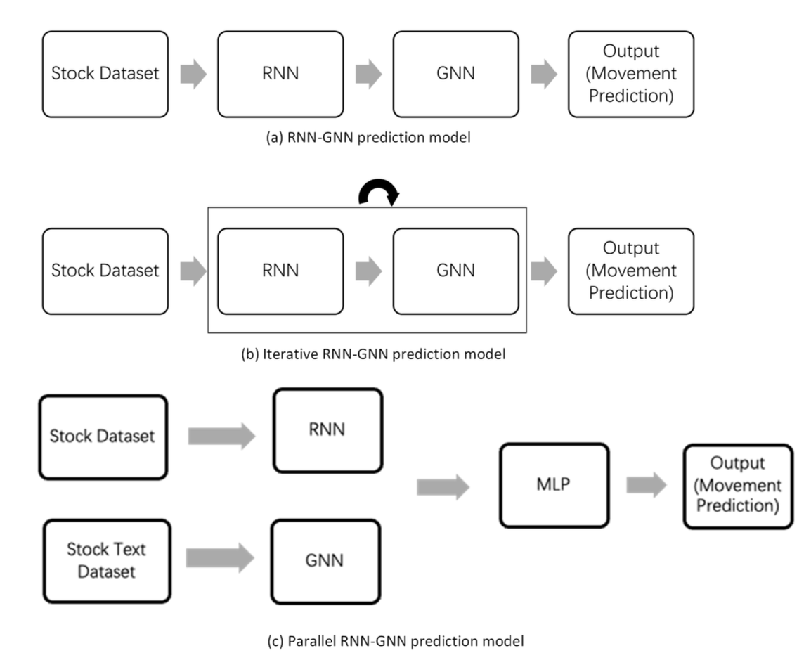
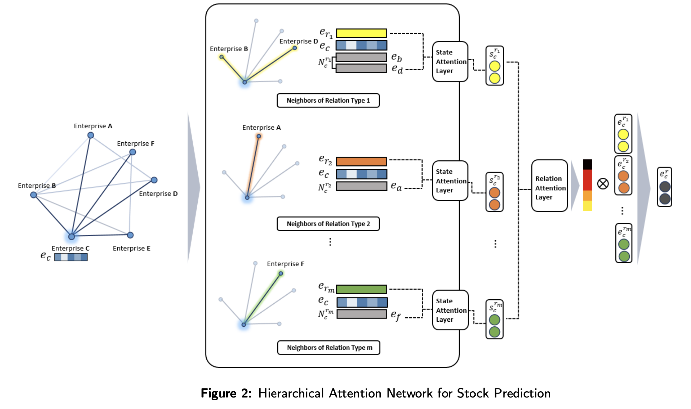

## Basic Theory

Graph neural network computes hiden state for each node.

### GCN

$$ H^{(l+1)} = \sigma(\tilde{D}^{-1/2} \tilde{A} \tilde{D}^{-1/2} H^{(l)} W^{(l)}) $$

- $H^{(l)}$: hidden state in layer l
- $H^{(l)} W^{(l)}$: hidden state went through a linear transformation
- $\tilde{A}$: Original adjacent matrix + identity matrix: consider the node itself for feature, and this is a learnable parameter:
$$
\tilde{A} = A + \alpha I
$$
- $\tilde{D}$: Degree matrix, including the node itself
- $\tilde{D}^{-1/2} \tilde{A} \tilde{D}^{-1/2}$: the weight of each edge is $\frac{1}{\sqrt{d_i d_j}}$, similar to convolution operation.

### GAT
- Feature went through a linear transformation
$h_i' = Wh_i$
- Compute attention score between neighbors
$$
e_{ij} = LeakyReLU(a^T[h_i'||h_j'])
$$

&emsp;$[h_i'||h_j']$ means concatenation
&emsp;$a$ is a learnable vector

- Normalize attention score
$$
\alpha_{ij} = \frac{\exp(e_{ij})}{\sum_{k \in \mathcal{N}(i)} \exp(e_{ik})}
$$

- Update hidden state
$$
\mathbf{h}_i^{\text{new}} = \sigma \left( \sum_{j \in \mathcal{N}(i)} \alpha_{ij} \, \mathbf{h}_j' \right)
$$

- Multi-head attention
$$
\text{GAT}(i) = \big\Vert_{k=1}^{K} \, \sigma \left( \sum_{j \in \mathcal{N}(i)} \alpha_{ij}^{(k)} \, W^{(k)} \mathbf{h}_j \right)
$$

::: {.callout-note title="🧠 Thought"}

The attention mechanism computes **learnable importance weights** that quantify how much each item in a sequence (or each neighbor in a graph) contributes to a target item.

- In Transformer, there are 3 learnable matrices for key, query, and value.
- In GAT, there are vector $a$ and linear transformation matrix $W$.

:::

## Literature Research

- [A Short Survey on Graph Neural Networks Based Stock Market Prediction Models](https://personales.upv.es/thinkmind/dl/conferences/iciw/iciw_2024/iciw_2024_1_30_20016.pdf)

There're 3 model architectures:

### RNN-GNN Architecture

Time series data is fed into RNN to get hidden state, then the hidden state is fed into GNN to get the final prediction.

Example:

- [HATS: A Hierarchical Graph Attention Network for Stock Movement Prediction](https://arxiv.org/abs/1908.07999)

Each node represents a stock, and the edges represent the relations between stocks.  

There're different types of relations.  

And for each node i, it has a set of neighbors $N_i^{r_m}$ for each relation $r_m$.  

Each relation type $r_m$ has an embedding $e_{r_m}$.  

- **Hierarchical attention mechanism:**
  1. State attention layer: For each node, compute the attention score for each neighbot within each relation type (Concatenate $e_{r_m}$, $e_i$, $e_j$, where $e_j \in {N_i}^{r_m}$ for attention score). 

**Next...** How to construct the graph? Where is $e_{r_m}$ from?
